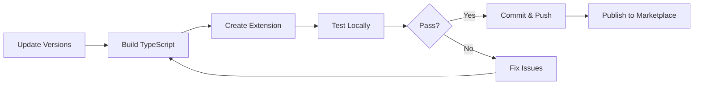

# Build and Release Instructions

## 📋 Pre-Build Checklist

Before building the extension, **ALWAYS** update the version in both files:

### 1. Update `task/task.json`
```json
"version": {
  "Major": "0",
  "Minor": "0",
  "Patch": "X"  // ← Increment this
}
```

### 2. Update `vss-extension.json`
```json
"version": "0.0.X"  // ← Must match task.json patch version
```

> ⚠️ **Important**: Both versions must be in sync!

---

## 🔨 Build Process

### Step 1: Clean and Build TypeScript
```bash
cd task
Remove-Item -Recurse -Force dist -ErrorAction SilentlyContinue
npm run build
```

### Step 2: Verify Build
```bash
# Check that dist folder was created
Get-ChildItem dist
```

### Step 3: Create Extension Package
```bash
cd ..
tfx extension create --manifest-globs vss-extension.json
```

---

## 📦 Output

The build will generate:
```
junior151280.cd11d9f3-81f4-4580-b689-066a2a51bad8-X.X.X.vsix
```

---

## 🚀 Release to Azure DevOps Marketplace

### Option 1: Web UI
1. Go to https://marketplace.visualstudio.com/manage
2. Click on your publisher (junior151280)
3. Update the extension
4. Upload the new `.vsix` file

### Option 2: Command Line
```bash
tfx extension publish --manifest-globs vss-extension.json --share-with <organization>
```

---

## 🧪 Testing

### Local Testing
1. Upload to Azure DevOps organization
2. Install in target project
3. Run pipeline with PR trigger
4. Verify review comments appear

### Validation Checklist
- [ ] Version numbers match in both files
- [ ] Extension builds without errors
- [ ] Task runs without module errors
- [ ] Reviews are posted to PR
- [ ] Token usage is logged
- [ ] No vulnerabilities (`npm audit`)

---

## 📝 Version History

| Version | Date | Changes |
|---------|------|---------|
| 0.0.1 | 2025-11-18 | Initial modernization release |
| 0.0.2 | 2025-11-18 | Fixed binary-extensions module error |

---

## 🔄 Release Workflow



---

## 📚 Related Commands

```bash
# Install TFX CLI (if not installed)
npm install -g tfx-cli

# Login to marketplace
tfx login

# Check extension details
tfx extension show --publisher junior151280 --extension-id cd11d9f3-81f4-4580-b689-066a2a51bad8

# List installed extensions
tfx extension list --publisher junior151280
```
